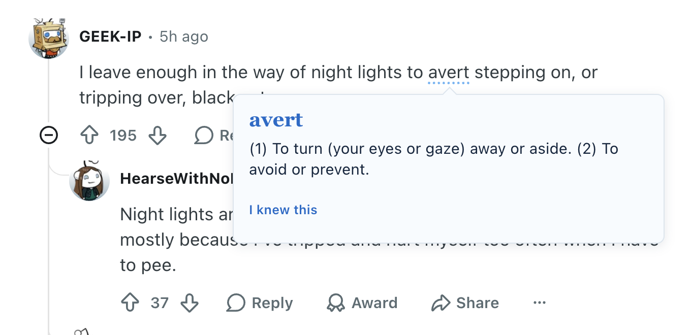

# Wordpool

A Chrome extension that embeds contextual vocabulary learning into everyday web browsing.

## The idea

Vocabulary apps ask you to set aside time. Wordpool works the other way round: it puts new words into pages you were already going to read.

On sites you choose, it swaps roughly one word every few sentences for a rarer synonym from a hand-checked list of 694 pairs. Swapped words carry a dotted underline, so you always know which ones are yours and which belong to the writer.

## Three interactions

**Hover** shows the original word in place. The replacement stays in the layout and the original is painted over it, so the line never reflows and you never lose your place mid-sentence.

**Click** opens a compact card with the definition, anchored to the word rather than centered on the page.

**I knew this** removes the word from rotation and adds it to your pool.

## Install

The repository is the extension. There is no build step.

1. Clone or download this repository
2. Open `chrome://extensions`
3. Turn on Developer mode
4. Click Load unpacked and select the folder
5. Open a site you want it on, click the Wordpool icon, and turn on Active

Built with vanilla JavaScript, HTML and CSS on Chrome Manifest V3. No framework and no dependencies. Type is Atkinson Hyperlegible Next and Crimson Text, loaded from Google Fonts.
